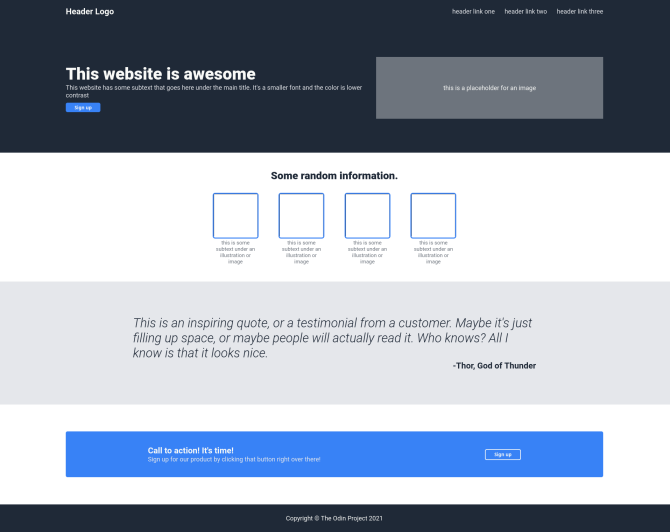

# The Odin Project - Project: Landing Page

This is a solution to [Project: Landing Page on The Odin Project](https://www.theodinproject.com/lessons/foundations-landing-page).

## The Goal

- To create an entire web page from the designs provided: 
  - [one](https://cdn.statically.io/gh/TheOdinProject/curriculum/81a5d553f4073e593d23a6ab00d50eef8620796d/foundations/html_css/project/imgs/01.png) 
  - [two](https://cdn.statically.io/gh/TheOdinProject/curriculum/81a5d553f4073e593d23a6ab00d50eef8620796d/foundations/html_css/project/imgs/02.png)

## Live Site

- URL: https://themightypillow.github.io/odin-landing-page/

## Screenshot

## Built With

- Semantic HTML
- CSS Custom Properties
- Flexbox